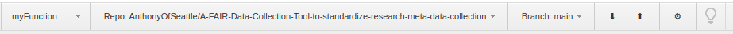
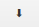
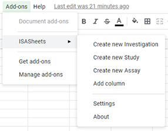
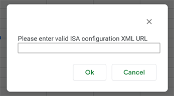
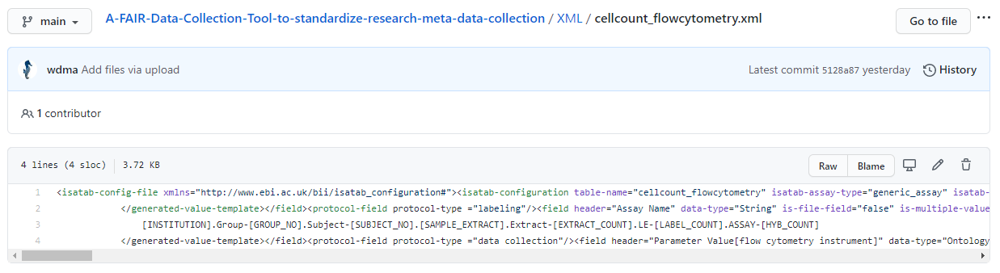
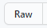

# ISASheets 

### What is FAIR data and the ISA model?

**FAIR** data are quantifiable observations that have been made **findable**, **accessible**, **interoperable** and **reusable**.
This paradigm can go a long way to ensuring that data is easily sharable between investigators,
and furthers reproducibility by providing rich, standardized metadata for samples.
The **investigation**, **study** and **assay** (ISA) model is one formalization of FAIR practices,
and defines both hierachical data [schemas](https://isatools.readthedocs.io/en/latest/isamodel.html) (XML, JSON) as well as a tab delimited format (Tab)
to facilitate data transfer and readability.

### What problem does our tool solve?
While frameworks like the ISA exists, there is a barrier for data generators to compile their data in these standardized formats. Using our tool, users are able to generate ISA commons compliant spreadsheets where metadata about investigations can be collected and continually validated without requiring detailed familiarity of schema structure up front.

Our tool is a Google sheets application build surrounding the ISA framework which facilitates the collection of metadata according to 
[schema](https://github.com/ISA-tools/Configuration-Files/tree/master/isaconfig-default_v2015-07-02). Additionally, the ISA framework has a large suite of [tools](https://isa-tools.org/) that can be used in conjunction with the ISA-Sheets or ISA-ATTRACTION making it a valuable and versatile tool. 

Our tool aims to: 
1. Facilitate metadata collection using a familiar user interface
2. Allow the portability of (meta)data entry to the data source 
3. Facilitate the upload of structured (meta)data to the cloud for easy sharing

### Overview of the tool 

## Installation

### From Github

1. **Install the Google Apps Script Github Assistant:** 
Currently, the only browser with an extension to integrate Github into the Google apps environment is Chrome. Link: [Google Apps Script GitHub Assistant](https://chrome.google.com/webstore/detail/google-apps-script-github/lfjcgcmkmjjlieihflfhjopckgpelofo?hl=en)

2. **Fork the ISA-Sheets Repo:**
For the Github Assistant to recognize the ISA-Sheets repository, you must create a fork owned by your github account.

3. **Create a blank Google Apps Script project:**
Navigate to [script.google.come](https://script.google.com/) and select `New Project` from the top left.
Rename the project to whatever makes sense to you, e.g. ISA-Sheets.

4. **Select the ISA-Sheets fork:**
From the `repository` drop down menu, select the repository 
`[yourGithubAccount]/A-FAIR-Data-Collection-Tool-to-standardize-research-meta-data-collection`.
After selecting the repository, be sure that the `main` branch is selected.

5. **Pull the repository:**
Press the  icon and select `pull` again when the diff screen apears.

6. **Create a new spreadsheet and deploy:**
In a new tab, create a new Google Sheets document and give it a name that makes sense to you.
Navigate back to the tab with your ISA-Sheets script and select `Test as add on...` from the `run` menu.

In the popup window, select `Installed and enabled` from the `Installation config` menu,
and click `select doc` to select the spreadsheet you made.

After clicking save, you can select the test in the `Execute Saved Test` list above 
and press `test` to open a new spreadsheet with the Add-on enabled.

### From the Google marketplace
*Stay tuned...*

## Using ISASheets
1. **Menu overview**

A new menu will appear in the add-on options. Here you can choose which action to perform
* Add Investigation, Study, or Assay: Use to create new templates in your current sheet document

Choose any of the options and a popup requesting the url of your ISA configuration (XML format) will appear.

2. **Finding XML configurations**
ISASheets parses XML configurations found in Github. To obtain the URL for the XML go to the file inside the repository 

Choose the  and copy the URL at the top. Use this to enter into the pop up box then select the .
ISASheets will recognized if it is an Investigation, Study, or Assay template using the XML metadata.

3. **Populate your template**
Google Sheets allows you to enter your data as you would for a standard spreadsheet

4. **Export your data**

## Questions and feedback
Any inquiries or suggestions can be posted to the [issue page](https://github.com/STRIDES-Codes/A-FAIR-Data-Collection-Tool-to-standardize-research-meta-data-collection/issues). 

## People

Rance Nault, Michigan State University, naultran@msu.edu, **Team Lead and Corresponding**

Dale George, Northwestern University, dale.george@northwestern.edu

Diana Ma, Hippocampus Analytics, diana.ma@hippocampusanalytics.com

Diego Perez Ruiz, The University of Manchester, diego.perezruiz@manchester.ac.uk

Anthony Valente, University of Washington, valenta4@uw.edu
